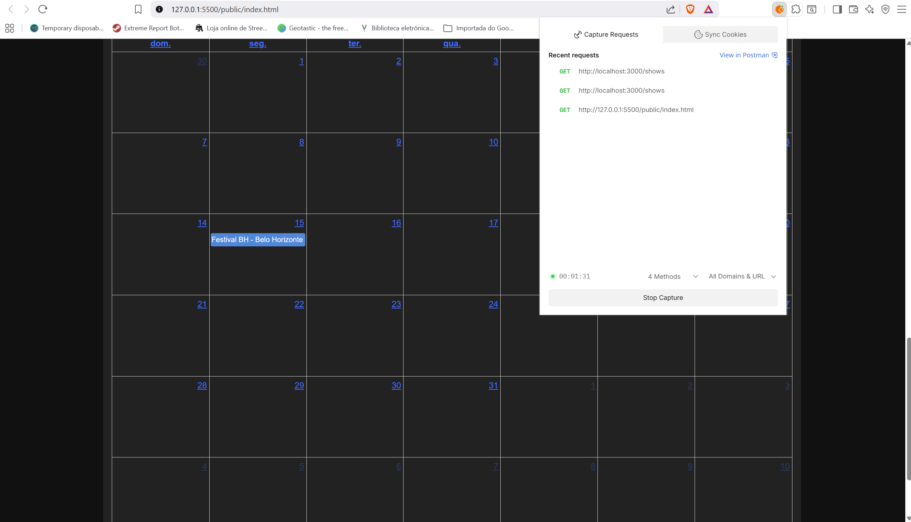
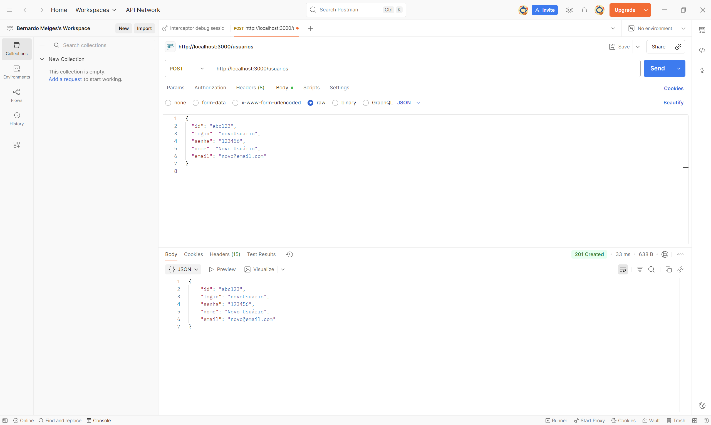
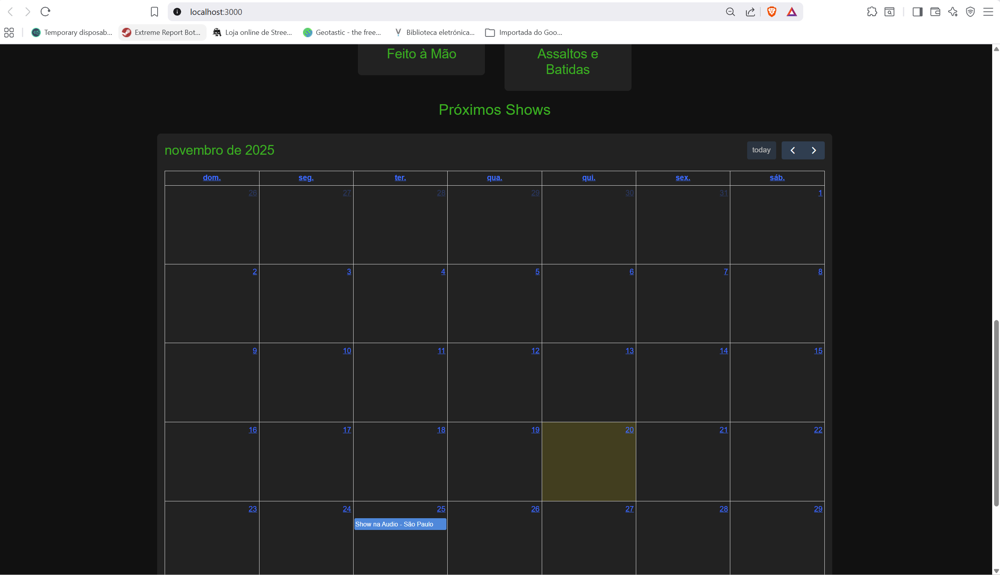
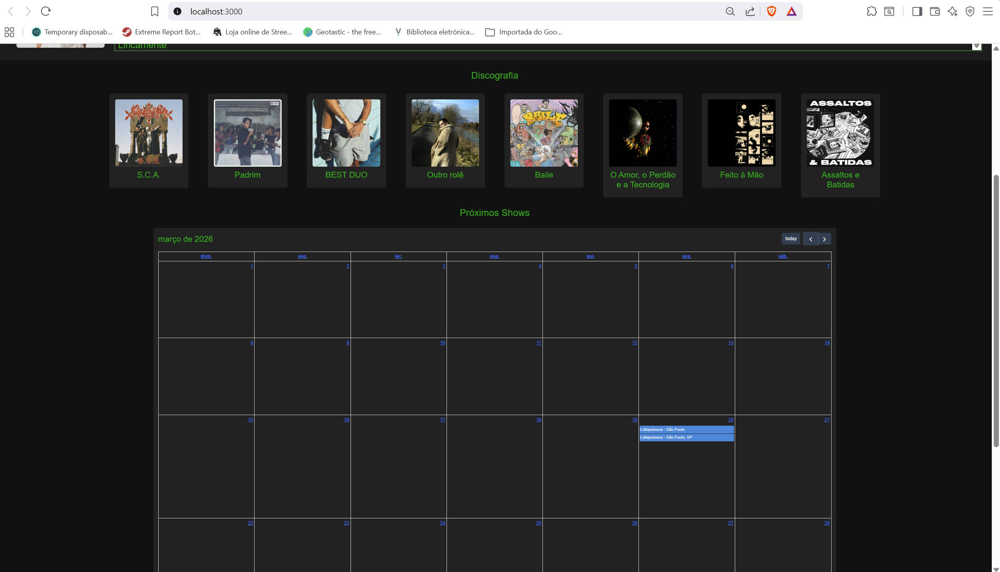

# Trabalho Prático 07 - Semanas 13 e 14

A partir dos dados cadastrados na etapa anterior, vamos trabalhar formas de apresentação que representem de forma clara e interativa as informações do seu projeto. Você poderá usar gráficos (barra, linha, pizza), mapas, calendários ou outras formas de visualização. Seu desafio é entregar uma página Web que organize, processe e exiba os dados de forma compreensível e esteticamente agradável.

Com base nos tipos de projetos escohidos, você deve propor **visualizações que estimulem a interpretação, agrupamento e exibição criativa dos dados**, trabalhando tanto a lógica quanto o design da aplicação.

Sugerimos o uso das seguintes ferramentas acessíveis: [FullCalendar](https://fullcalendar.io/), [Chart.js](https://www.chartjs.org/), [Mapbox](https://docs.mapbox.com/api/), para citar algumas.

## Informações do trabalho

- Nome: Bernardo Melges dos Anjos
- Matricula: 897998
- Proposta de projeto escolhida: Pessoas e Produções
- Breve descrição sobre seu projeto: O projeto é a criação de um site de procura de artistas, porém a homepage criada será relacionada ao artista Fabricio Soares Teixeira, mais conhecido como FBC, que ganhou notoriedade no nicho do rap. Ademais, o site vai abordar sua bibliografia, discografia e próximos shows.

**Print da tela com a implementação**

<< Nesta etapa foi feita uma implementação de um calendário, atraves do FullCalendar, ele irá possibilitar fãs do artista FBC, encontrarem os póximos shows de forma mais fácil e eficiente.>>

<<  >>
<<  >>

<<  >>

<<  >>
